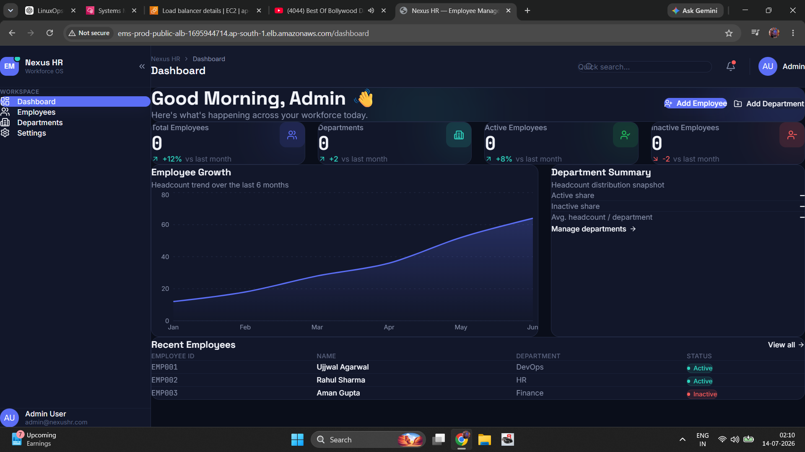
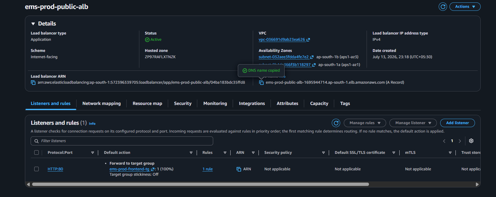
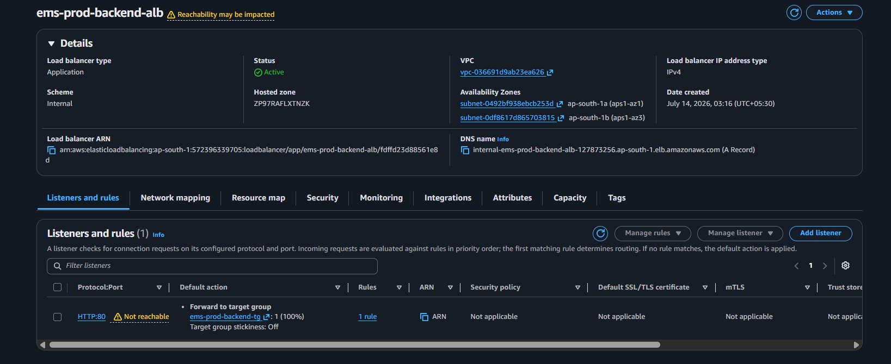
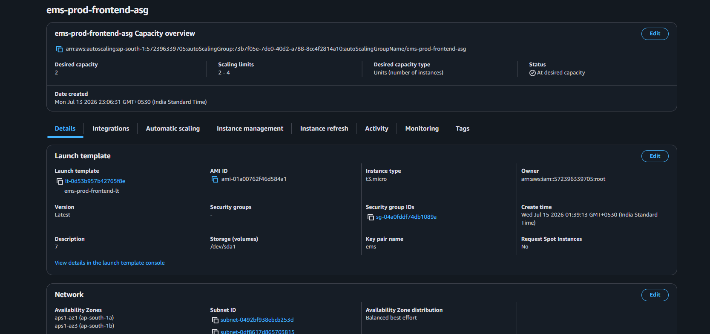
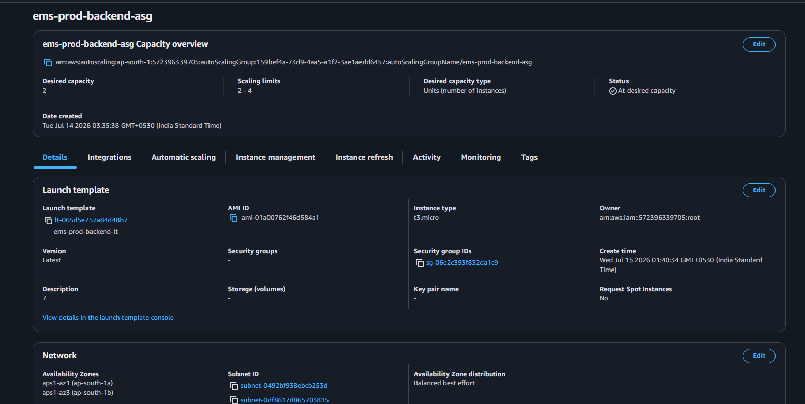
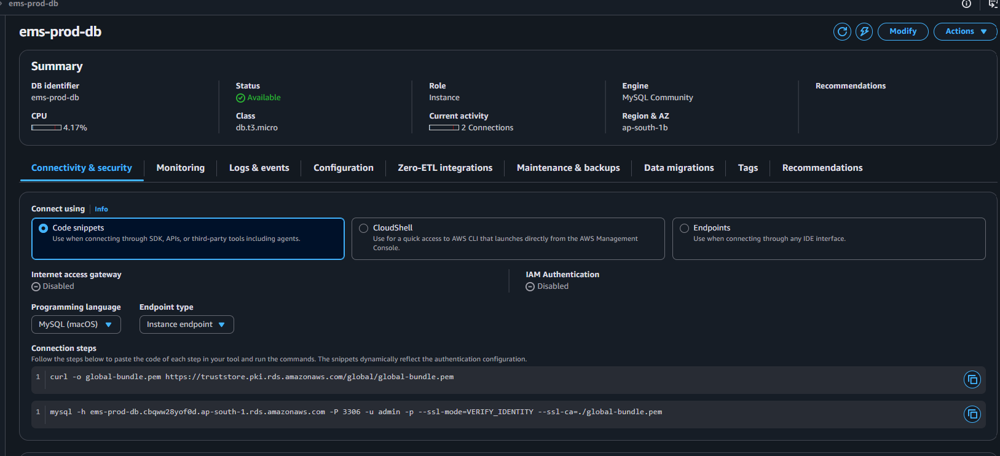
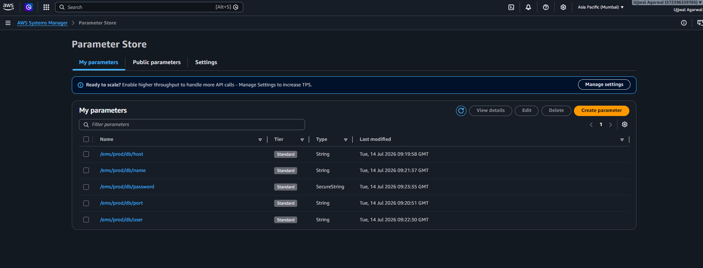
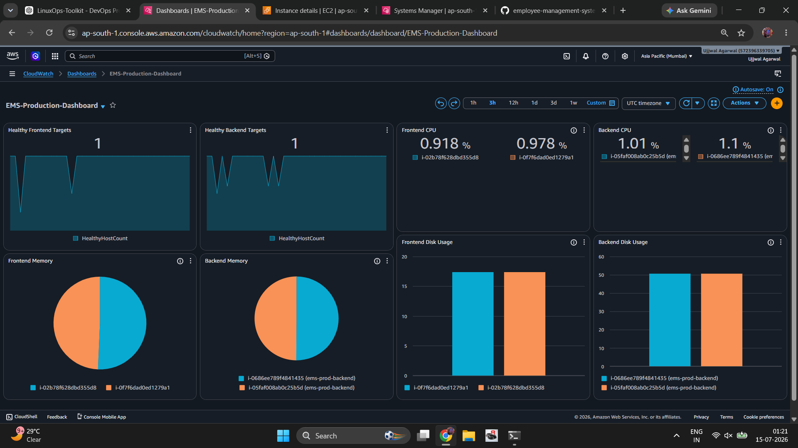
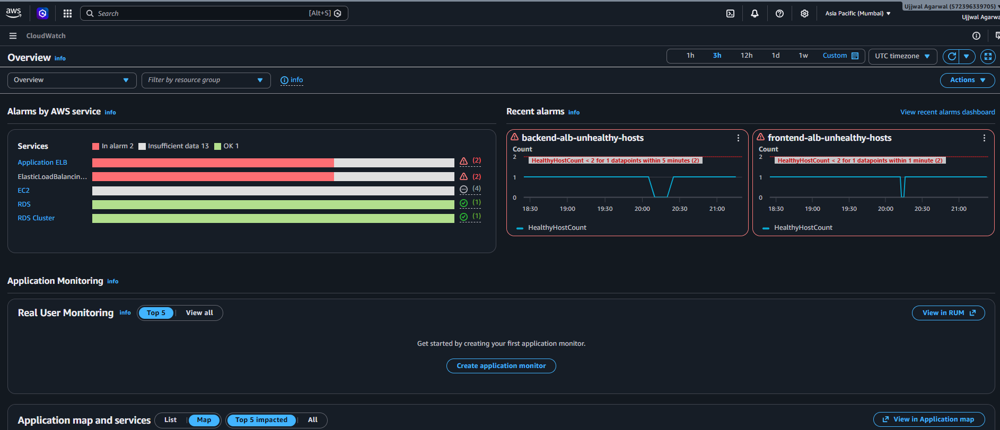

# 🚀 Employee Management System

<div align="center">

## Production-Ready AWS Cloud & DevOps Project

*A highly available, production-grade Employee Management System deployed on AWS using modern DevOps practices, Infrastructure Automation, and Cloud-Native Architecture.*

<p>


</p>

<p>


</p>

</div>

---

# 📑 Table of Contents

- [Project Overview](#-project-overview)
- [Key Features](#-key-features)
- [Technology Stack](#-technology-stack)
- [AWS Services Used](#-aws-services-used)
- [Architecture Overview](#-architecture-overview)
- [Repository Structure](#-repository-structure)
- [Deployment Workflow](#-deployment-workflow)
- [Monitoring & Observability](#-monitoring--observability)
- [Screenshots](#-screenshots)
- [Getting Started](#-getting-started)
- [Project Roadmap](#-project-roadmap)
- [Known Limitations](#-known-limitations)
- [Future Enhancements](#-future-enhancements)
- [Learning Outcomes](#-learning-outcomes)
- [Author](#-author)
- [License](#-license)

---

# 📌 Project Overview

The **Employee Management System (EMS)** is a production-oriented cloud deployment project designed to demonstrate real-world AWS Infrastructure, DevOps automation, monitoring, and high availability practices.

Rather than focusing only on CRUD functionality, this project emphasizes the complete lifecycle of deploying, operating, monitoring, and scaling an application in a production-like AWS environment.

The application follows a **three-tier architecture** consisting of:

- **React Frontend**
- **FastAPI Backend**
- **Amazon RDS MySQL Database**

The infrastructure is designed with scalability, fault tolerance, observability, and maintainability in mind.

---

# 🎯 Project Objectives

The primary objectives of this project are:

- Design a highly available AWS infrastructure
- Deploy a scalable web application
- Implement secure networking using public and private subnets
- Automate EC2 provisioning with Launch Templates
- Configure Auto Scaling for high availability
- Secure database credentials using AWS Systems Manager Parameter Store
- Monitor infrastructure using Amazon CloudWatch
- Configure alerting with Amazon SNS
- Build a production-ready repository following enterprise DevOps standards

---

# ✨ Key Features

## ☁️ Cloud Infrastructure

- Multi-AZ AWS Deployment
- Public & Private Subnets
- Internet Gateway
- NAT Gateway
- Route Tables
- Security Groups

---

## 🚀 Compute Layer

- Amazon EC2
- Launch Templates
- Auto Scaling Groups
- Self-Healing Infrastructure
- Automated Bootstrap Scripts

---

## 🌐 Networking

- Public Application Load Balancer
- Internal Application Load Balancer
- Health Checks
- Target Groups

---

## 🗄 Database

- Amazon RDS MySQL
- Private Database Deployment
- Secure Parameter Store Integration

---

## 📊 Monitoring

- Amazon CloudWatch Agent
- CPU Monitoring
- Memory Monitoring
- Disk Monitoring
- CloudWatch Dashboard
- CloudWatch Alarms
- SNS Email Notifications

---

## ⚙️ Automation

- Automated Frontend Bootstrap
- Automated Backend Bootstrap
- Parameter Store Integration
- Systemd Service Configuration
- CloudWatch Agent Installation

---

## 📁 Repository

- Enterprise Repository Structure
- Infrastructure as Code Ready
- Platform Engineering Layout
- Documentation Driven Development

---

# 📌 Current Project Status

| Phase | Status |
|--------|--------|
| AWS Infrastructure | ✅ Completed |
| Monitoring | ✅ Completed |
| Auto Scaling | ✅ Completed |
| Parameter Store | ✅ Completed |
| CloudWatch Dashboard | ✅ Completed |
| CloudWatch Alarms | ✅ Completed |
| SNS Notifications | ✅ Completed |
| Bootstrap Automation | ✅ Completed |
| CodeDeploy | 🚧 Planned (OS compatibility pending) |
| HTTPS | 🚧 Planned (Domain pending) |

Current Release

```
v1.0.0-beta
```

---# 💻 Technology Stack

## Frontend

| Technology | Purpose |
|------------|---------|
| React.js | User Interface |
| Vite | Frontend Build Tool |
| Axios | API Communication |
| HTML5 | Markup |
| CSS3 | Styling |
| JavaScript (ES6+) | Client-side Logic |

---

## Backend

| Technology | Purpose |
|------------|---------|
| FastAPI | REST API |
| Python | Backend Language |
| SQLAlchemy | ORM |
| Uvicorn | ASGI Server |
| Pydantic | Data Validation |
| PyMySQL | MySQL Driver |

---

## Database

| Technology | Purpose |
|------------|---------|
| Amazon RDS MySQL | Relational Database |

---

## Cloud Platform

| Service | Purpose |
|----------|---------|
| Amazon EC2 | Application Hosting |
| Amazon VPC | Network Isolation |
| Application Load Balancer | Traffic Distribution |
| Auto Scaling Groups | High Availability |
| Launch Templates | Automated EC2 Provisioning |
| IAM | Identity & Access Management |
| Systems Manager Parameter Store | Secure Configuration |
| CloudWatch | Monitoring |
| SNS | Notifications |

---

## DevOps & Platform Engineering

| Tool | Purpose |
|------|---------|
| Linux (Ubuntu) | Operating System |
| Bash | Automation Scripts |
| Git | Version Control |
| GitHub | Source Code Management |
| Nginx | Reverse Proxy |
| Systemd | Service Management |

---

# ☁️ AWS Services Used

| AWS Service | Usage |
|-------------|-------|
| Amazon EC2 | Frontend & Backend Compute |
| Amazon VPC | Private Networking |
| Public Subnets | Load Balancer Layer |
| Private Subnets | Backend & Database |
| Internet Gateway | Internet Access |
| NAT Gateway | Outbound Internet for Private Subnets |
| Route Tables | Traffic Routing |
| Security Groups | Firewall Rules |
| Auto Scaling | Self-Healing Infrastructure |
| Launch Templates | Standardized EC2 Deployment |
| Application Load Balancer | HTTP Load Balancing |
| Amazon RDS | MySQL Database |
| Systems Manager Parameter Store | Database Credentials |
| IAM | Secure Permissions |
| CloudWatch | Monitoring & Logging |
| SNS | Email Notifications |

---

# 🏗️ Architecture Overview

The application follows a highly available three-tier architecture.

```text
                        Internet
                            │
                            ▼
               Public Application Load Balancer
                            │
             ┌──────────────┴──────────────┐
             │                             │
             ▼                             ▼
      Frontend EC2                  Frontend EC2
      Auto Scaling Group            Auto Scaling Group
             │                             │
             └──────────────┬──────────────┘
                            │
                     Internal Load Balancer
                            │
             ┌──────────────┴──────────────┐
             │                             │
             ▼                             ▼
       Backend EC2                  Backend EC2
       Auto Scaling Group           Auto Scaling Group
             │                             │
             └──────────────┬──────────────┘
                            │
                            ▼
                    Amazon RDS MySQL
```

---

# 🛡️ High Availability Design

The infrastructure is designed with production availability in mind.

### Frontend Layer

- Public Application Load Balancer
- Multiple EC2 instances
- Auto Scaling Group
- Health Checks
- Automatic Instance Replacement

---

### Backend Layer

- Internal Application Load Balancer
- Multiple Backend Servers
- Auto Scaling Group
- Private Networking

---

### Database Layer

- Amazon RDS
- Private Subnets
- Security Group Isolation
- Parameter Store Integration

---

### Monitoring Layer

- Amazon CloudWatch
- CloudWatch Agent
- CloudWatch Dashboard
- CloudWatch Alarms
- Amazon SNS

---

# 🔄 Request Flow

```text
User

↓

Public Application Load Balancer

↓

Frontend Auto Scaling Group

↓

Internal Load Balancer

↓

Backend Auto Scaling Group

↓

Amazon RDS MySQL
```

---

# 📂 Repository Structure

```text
employee-management-system/

├── app/
│   ├── backend/
│   └── frontend/
│
├── platform/
│   ├── bootstrap/
│   ├── cicd/
│   ├── gitops/
│   ├── iac/
│   ├── observability/
│   ├── security/
│   ├── templates/
│   └── ai-platform/
│
├── aws/
│
├── assets/
│
├── diagrams/
│
├── docs/
│
├── tests/
│
├── README.md
├── CHANGELOG.md
├── CONTRIBUTING.md
└── LICENSE
```

---

# 📁 Repository Explanation

| Directory | Description |
|------------|-------------|
| `app/` | Frontend & Backend Application Source Code |
| `platform/bootstrap/` | User Data, Systemd Services & Bootstrap Scripts |
| `platform/iac/` | Terraform & Ansible Infrastructure |
| `platform/cicd/` | Jenkins, GitHub Actions & AWS Native CI/CD |
| `platform/gitops/` | Kubernetes, Helm & ArgoCD |
| `platform/observability/` | CloudWatch, Prometheus, Grafana & Loki |
| `platform/security/` | Security Scanning & Compliance |
| `docs/` | Project Documentation |
| `diagrams/` | Architecture Diagrams |
| `assets/` | Images & Screenshots |
| `tests/` | Backend, Frontend & Infrastructure Tests |

---

# 🏛️ Infrastructure Components

## Compute

- Frontend Auto Scaling Group
- Backend Auto Scaling Group
- Launch Templates

---

## Networking

- VPC
- Public Subnets
- Private Subnets
- Internet Gateway
- NAT Gateway
- Route Tables

---

## Load Balancing

- Public ALB
- Internal ALB
- Target Groups
- Health Checks

---

## Database

- Amazon RDS MySQL

---

## Monitoring

- CloudWatch Dashboard
- CloudWatch Alarms
- SNS Notifications
- CloudWatch Agent

---

## Security

- IAM Roles
- Security Groups
- Systems Manager Parameter Store

---
# 🚀 Deployment Workflow

The Employee Management System follows a production-inspired deployment workflow that automates infrastructure provisioning, application deployment, monitoring, and recovery.

```text
                Developer
                    │
                    ▼
            GitHub Repository
                    │
                    ▼
          Launch Templates
                    │
                    ▼
         Auto Scaling Groups
                    │
                    ▼
       EC2 Bootstrap Automation
                    │
         ┌──────────┴──────────┐
         │                     │
         ▼                     ▼
 Frontend Service       Backend Service
         │                     │
         └──────────┬──────────┘
                    ▼
              Amazon RDS
                    │
                    ▼
          CloudWatch Monitoring
                    │
                    ▼
            Amazon SNS Alerts
```

---

# ⚙️ Infrastructure Automation

The EC2 instances are fully automated using Launch Templates and bootstrap scripts.

During instance provisioning, the bootstrap process automatically:

- Updates the operating system
- Installs required packages
- Configures Nginx
- Installs Python dependencies
- Installs Node.js (Frontend)
- Retrieves database configuration from AWS Systems Manager Parameter Store
- Starts backend services
- Builds and deploys the frontend
- Configures CloudWatch Agent
- Registers the instance with the Load Balancer

This allows newly launched instances to become operational without manual intervention.

---

# 📈 Monitoring & Observability

The project includes infrastructure monitoring using Amazon CloudWatch.

## Metrics Collected

| Category | Metrics |
|-----------|---------|
| Compute | CPU Utilization |
| Memory | Memory Usage |
| Storage | Disk Utilization |
| Networking | Network In / Network Out |
| Application | Healthy Host Count |
| Load Balancer | Target Health |
| Infrastructure | EC2 Status |

---

## Monitoring Components

- Amazon CloudWatch Agent
- CloudWatch Dashboard
- CloudWatch Alarms
- Amazon SNS Email Notifications

---

## Current CloudWatch Alarms

| Alarm | Description |
|---------|------------|
| Frontend CPU High | Alerts when CPU exceeds threshold |
| Backend CPU High | Alerts when CPU exceeds threshold |
| Frontend Memory High | Memory utilization monitoring |
| Backend Memory High | Memory utilization monitoring |
| Disk Utilization | Storage monitoring |

---

# 🧪 High Availability Validation

The infrastructure has been validated using failure simulation tests.

## Test 1 — Frontend Auto Recovery

**Objective**

Terminate a frontend EC2 instance.

**Expected Result**

- Auto Scaling launches a replacement instance
- Bootstrap executes successfully
- Target becomes healthy
- Application remains accessible

**Status**

✅ Passed

---

## Test 2 — Backend Auto Recovery

**Objective**

Terminate a backend EC2 instance.

**Expected Result**

- Backend ASG launches a new instance
- Backend registers with Internal Load Balancer
- Database connectivity restored automatically

**Status**

✅ Passed

---

## Test 3 — Parameter Store Integration

**Objective**

Verify secure retrieval of database credentials.

**Validation**

- IAM Role attached
- Parameters retrieved successfully
- Backend connected to Amazon RDS

**Status**

✅ Passed

---

## Test 4 — Monitoring Validation

**Objective**

Verify monitoring pipeline.

**Validation**

- CloudWatch Agent installed
- Metrics published
- Dashboard updated
- SNS notification received

**Status**

✅ Passed

---

# 📸 Project Screenshots

## Application

|Dashboard| 
|-------|
|  |

---

## AWS Infrastructure

| Public ALB | Internal ALB |
|------------|--------------|
|  |  |

---

| Frontend ASG | Backend ASG |
|--------------|-------------|
|  |  |

---

| RDS | Parameter Store |
|-----|-----------------|
|  |  |

---

| CloudWatch Dashboard | CloudWatch Alarms |
|----------------------|-------------------|
|  |  |

---

# 🛠️ Getting Started

## Clone the Repository

```bash
git clone https://github.com/Mr-Ujjwal-Agarwal/employee-management-system.git

cd employee-management-system
```

---

## Backend Setup

```bash
cd app/backend

python3 -m venv venv

source venv/bin/activate

pip install -r requirements.txt

uvicorn app.main:app --reload
```

---

## Frontend Setup

```bash
cd app/frontend

npm install

npm run dev
```

---

## Production Deployment

Infrastructure deployment includes:

- Launch Templates
- Auto Scaling Groups
- Public & Internal Load Balancers
- Amazon RDS
- Parameter Store
- CloudWatch
- SNS

Bootstrap scripts automatically configure each EC2 instance during launch.

---

# 🧰 Operations Overview

Routine operational tasks include:

- Monitoring CloudWatch dashboards
- Reviewing CloudWatch alarms
- Checking Auto Scaling activity
- Monitoring target health
- Reviewing EC2 bootstrap logs
- Verifying Parameter Store access
- Inspecting RDS connectivity
- Validating SNS notifications

---

# 🔍 Troubleshooting

| Issue | Resolution |
|--------|------------|
| Target Unhealthy | Review EC2 bootstrap logs and health check configuration |
| Backend Connection Failure | Verify Parameter Store values and IAM permissions |
| CloudWatch Metrics Missing | Confirm CloudWatch Agent is installed and running |
| Database Connection Failure | Check RDS Security Groups and credentials |
| Auto Scaling Failure | Review Launch Template and ASG activity history |

---
# 🛣️ Project Roadmap

The project is being developed in multiple phases to progressively build a production-ready cloud platform.

| Phase | Description | Status |
|-------|-------------|--------|
| Phase 1 | AWS Infrastructure, High Availability, Monitoring | ✅ Completed |
| Phase 2 | AWS Native CI/CD (CodeDeploy, CodePipeline, GitHub Actions) | 🚧 Planned |
| Phase 3 | HTTPS, Route53, ACM, CloudFront | ⏳ Planned |
| Phase 4 | Docker, Kubernetes, Helm, ArgoCD, GitOps | ⏳ Planned |
| Phase 5 | Agentic DevOps, AI Automation, Advanced Observability & Security | ⏳ Planned |

---

# 📌 Phase 1 Deliverables

## Infrastructure

- ✅ Multi-AZ VPC
- ✅ Public & Private Subnets
- ✅ Internet Gateway
- ✅ NAT Gateway
- ✅ Route Tables
- ✅ Security Groups

---

## Compute

- ✅ Frontend Auto Scaling Group
- ✅ Backend Auto Scaling Group
- ✅ Launch Templates
- ✅ Automated EC2 Bootstrap
- ✅ Self-Healing Infrastructure

---

## Networking

- ✅ Public Application Load Balancer
- ✅ Internal Application Load Balancer
- ✅ Target Groups
- ✅ Health Checks

---

## Database

- ✅ Amazon RDS MySQL
- ✅ Secure Private Networking
- ✅ Systems Manager Parameter Store

---

## Monitoring

- ✅ CloudWatch Dashboard
- ✅ CloudWatch Agent
- ✅ CloudWatch Alarms
- ✅ SNS Email Notifications

---

## Repository

- ✅ Enterprise Repository Structure
- ✅ Documentation Framework
- ✅ Platform Engineering Layout

---

# ⚠️ Known Limitations

The following items are intentionally deferred to future phases.

### CodeDeploy

AWS CodeDeploy Agent currently does not support Ubuntu 26.04 LTS used in this project.

The deployment automation architecture is already prepared and will be completed after migrating to a supported operating system (Ubuntu 24.04 LTS or Amazon Linux 2023).

---

### HTTPS

HTTPS is pending because a custom domain has not yet been registered.

Planned implementation:

- Amazon Route53
- AWS Certificate Manager (ACM)
- HTTPS Listener
- HTTP → HTTPS Redirect
- Optional CloudFront Integration

---

# 🚀 Future Enhancements

## Phase 2

- AWS CodeDeploy
- AWS CodePipeline
- GitHub Actions
- Blue/Green Deployment
- Rolling Updates

---

## Phase 3

- Route53
- ACM SSL Certificate
- HTTPS
- CloudFront
- Custom Domain

---

## Phase 4

- Docker
- Docker Compose
- Amazon ECR
- Kubernetes
- Helm
- ArgoCD
- GitOps

---

## Phase 5

### Observability

- Prometheus
- Grafana
- Loki
- Alertmanager
- Distributed Tracing

### Security

- Trivy
- Checkov
- tfsec
- SonarQube
- Dependency Check

### AI Platform

- Deployment Agent
- Monitoring Agent
- Rollback Agent
- Documentation Agent
- Security Agent

---

# 🎓 Learning Outcomes

This project demonstrates hands-on experience with:

## Cloud Engineering

- AWS Networking
- Amazon EC2
- Auto Scaling
- Launch Templates
- Application Load Balancer
- Amazon RDS
- IAM
- Systems Manager Parameter Store

---

## DevOps

- Linux Administration
- Shell Scripting
- Infrastructure Automation
- Reverse Proxy Configuration
- Monitoring & Alerting
- High Availability Design
- Production Troubleshooting

---

## Software Engineering

- Repository Design
- Documentation
- Platform Engineering
- Production Architecture
- Operational Excellence

---

# 💼 Resume Highlights

This project showcases practical experience in:

- AWS Cloud Infrastructure
- Production Deployment
- High Availability Architecture
- Infrastructure Automation
- Cloud Monitoring
- Auto Scaling
- Linux Administration
- Platform Engineering
- DevOps Best Practices

---

# 📊 Project Statistics

| Category | Details |
|----------|---------|
| Cloud Provider | Amazon Web Services (AWS) |
| Architecture | Three-Tier |
| Availability | High Availability |
| Load Balancers | 2 |
| Auto Scaling Groups | 2 |
| Database | Amazon RDS MySQL |
| Monitoring | Amazon CloudWatch |
| Notifications | Amazon SNS |
| Configuration Management | Systems Manager Parameter Store |
| Deployment Strategy | Launch Templates + Bootstrap |

---

# 🤝 Contributing

Contributions, suggestions, and improvements are welcome.

Please read the `CONTRIBUTING.md` guide before opening an issue or submitting a pull request.

---

# 📄 License

This project is licensed under the MIT License.

See the `LICENSE` file for more information.

---

# 👨‍💻 Author

## Ujjwal Agarwal

**Aspiring Cloud & DevOps Engineer**

### Connect with me

- GitHub: https://github.com/Mr-Ujjwal-Agarwal
- LinkedIn: https://www.linkedin.com/in/ujjwal-agarwal16
- Email: iamujjwalagarwal99@gmail.com

---

# 🙏 Acknowledgements

Special thanks to:

- AWS Documentation
- FastAPI Documentation
- React Documentation
- Linux Community
- Open Source Contributors

---

<div align="center">

## ⭐ If you found this project useful, consider giving it a Star!

Building production-ready cloud infrastructure one project at a time.

Made  by **Ujjwal Agarwal**

</div>

