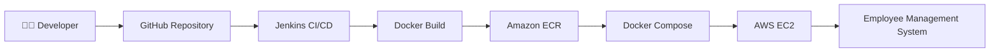
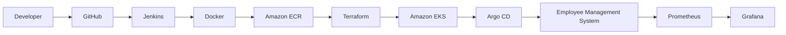
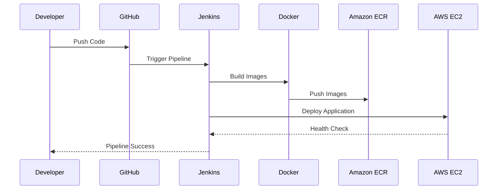

<div align="center">

# 🚀 Enterprise Employee Management System

### *A Production-Style DevOps Portfolio Project*


---


---


</div>

---

# 🌟 Project Overview

The **Enterprise Employee Management System (EMS)** is a comprehensive **DevOps portfolio project** designed to demonstrate how modern applications are built, containerized, automated, deployed, and managed using industry-standard tools and best practices.

Rather than being a simple CRUD application, this repository documents the **complete software delivery lifecycle**, progressing through multiple phases—from local development to cloud deployment, Infrastructure as Code, Kubernetes orchestration, monitoring, GitOps, and DevSecOps.

The project follows an **incremental engineering approach**, where every completed milestone builds upon the previous one without redesigning the overall architecture.

---

# 🎯 Project Vision

The objective of this repository is to simulate how an enterprise application evolves in a real-world DevOps environment.

Instead of showcasing only the final outcome, this repository captures the **engineering journey** through:

- 🐳 Application Containerization
- ☁️ AWS Cloud Deployment
- ⚙️ Enterprise CI/CD Automation
- 📦 Private Container Registry
- 🏗 Infrastructure as Code *(Upcoming)*
- ☸️ Kubernetes Orchestration *(Upcoming)*
- 🔄 GitOps Workflows *(Upcoming)*
- 📊 Monitoring & Observability *(Upcoming)*
- 🔐 DevSecOps & Security Automation *(Upcoming)*

---

> **💡 Philosophy**
>
> This repository is intentionally designed as a long-term engineering portfolio.
> Each phase extends the existing architecture rather than replacing it, allowing the project to evolve into a production-style DevOps platform over time.

---

# ✨ Project Highlights

<table>
<tr>
<td width="50%">

## 🚀 Enterprise DevOps Implementation

- ✅ Multi-Service Application
- ✅ Production-Ready Docker Images
- ✅ Automated CI/CD Pipeline
- ✅ Amazon ECR Integration
- ✅ Docker Compose Deployment
- ✅ Automated Health Verification
- ✅ Cloud-Native Architecture
- ✅ Modular Documentation

</td>

<td width="50%">

## 🎯 Upcoming Enterprise Features

- ⏳ Infrastructure as Code (Terraform)
- ⏳ Configuration Management (Ansible)
- ⏳ Kubernetes Orchestration
- ⏳ GitOps with Argo CD
- ⏳ Monitoring with Prometheus
- ⏳ Visualization with Grafana
- ⏳ Centralized Logging
- ⏳ DevSecOps Automation

</td>
</tr>
</table>

---

# 🏗️ What Makes This Repository Different?

Unlike traditional portfolio projects that focus only on application development, this repository emphasizes the **complete software delivery lifecycle**.

It demonstrates how modern organizations build, automate, deploy, and progressively scale applications using industry-standard DevOps practices.

The project is intentionally developed in **incremental milestones**, allowing each completed phase to become the foundation for the next without disrupting the overall architecture.

As the repository evolves, it will transition from a Docker-based deployment into a fully automated cloud-native platform powered by Infrastructure as Code, Kubernetes, GitOps, Monitoring, and DevSecOps.

---

# 🚀 Current Development Status

| Phase | Module | Status |
|:------:|---------|:------:|
| ✅ | Linux & Docker Fundamentals | Completed |
| ✅ | AWS Cloud Deployment | Completed |
| ✅ | Enterprise CI/CD with Jenkins | Completed |
| ⏳ | Infrastructure as Code (Terraform) | In Progress |
| ⏳ | Configuration Management (Ansible) | Planned |
| ⏳ | Kubernetes Orchestration | Planned |
| ⏳ | Monitoring & Observability | Planned |
| ⏳ | GitOps Implementation | Planned |
| ⏳ | DevSecOps Automation | Planned |

---

# ⚡ Current Enterprise Capabilities

### 🐳 Containerization

- Multi-container architecture
- Backend and Frontend isolated into separate services
- Production-ready Docker images
- Multi-stage Docker builds
- Docker Compose orchestration

---

### ☁ AWS Cloud

- Amazon EC2 Deployment
- Amazon Elastic Container Registry (ECR)
- Secure AWS Authentication
- Cloud-hosted production environment

---

### ⚙ Continuous Integration & Continuous Deployment

The application supports an automated deployment workflow that includes:

- Source Code Checkout
- Docker Image Build
- Amazon ECR Authentication
- Image Push
- Automated Deployment
- Post-Deployment Health Verification

---

### 🔐 Security

Current implementation includes:

- Private Amazon ECR repositories
- Jenkins Credentials Management
- Environment Variable Injection
- Secure Docker Image Distribution

Future phases will introduce:

- Secret Management
- Image Scanning
- Infrastructure Security
- Kubernetes RBAC
- Policy Enforcement

---

# 🎯 Learning Objectives

This project is designed to gain practical experience with enterprise DevOps workflows, including:

- Designing scalable application architectures
- Containerizing production applications
- Building automated CI/CD pipelines
- Deploying workloads on AWS
- Managing infrastructure using code
- Orchestrating applications with Kubernetes
- Implementing GitOps deployment strategies
- Monitoring distributed systems
- Applying DevSecOps best practices

---

# 📊 Project Progress

```text
████████████████████░░░░░░░░░░░░░░

Overall Completion : ~40%

✅ Linux
✅ Docker
✅ AWS
✅ Enterprise CI/CD

⏳ Terraform
⏳ Ansible
⏳ Kubernetes
⏳ Monitoring
⏳ GitOps
⏳ DevSecOps
```

---

# 🌍 Long-Term Vision

The long-term goal is to transform this repository into a **production-inspired DevOps platform** that demonstrates how modern software systems are built, deployed, managed, monitored, and secured using industry-standard tools.

Rather than treating each technology as an isolated topic, every phase contributes to a unified architecture that evolves throughout the project lifecycle.

# 🏛️ Enterprise Architecture

The Employee Management System follows a modular architecture that separates application development, containerization, continuous delivery, cloud infrastructure, and future platform automation.

As the project evolves, additional enterprise components such as Infrastructure as Code, Kubernetes, Monitoring, GitOps, and DevSecOps will be integrated **without redesigning the existing architecture**.

---

## 🌐 High-Level Architecture



---

## 🚀 Future Enterprise Architecture



> **📌 Note**
>
> Components from **Terraform onward** represent the planned evolution of the platform and will be introduced during future development phases.

---

# ⚙️ Technology Stack

## 💻 Application Layer

| Component | Technology |
|------------|------------|
| Frontend | React |
| Backend | FastAPI |
| Web Server | Nginx |
| Runtime | Python 3.12 |

---

## 🐳 Container Platform

| Component | Technology |
|------------|------------|
| Containerization | Docker |
| Multi-Container Deployment | Docker Compose |
| Image Registry | Amazon ECR |

---

## ☁️ Cloud Platform

| Component | Technology |
|------------|------------|
| Cloud Provider | AWS |
| Compute | Amazon EC2 |
| Registry | Amazon ECR |

---

## ⚙️ DevOps Stack

| Category | Tool |
|----------|------|
| Version Control | Git & GitHub |
| Continuous Integration | Jenkins |
| Continuous Deployment | Jenkins Pipeline |
| Shell Automation | Bash |

---

## 🚀 Upcoming Platform Stack

| Category | Planned Technology |
|----------|--------------------|
| Infrastructure as Code | Terraform |
| Configuration Management | Ansible |
| Container Orchestration | Kubernetes |
| GitOps | Argo CD |
| Monitoring | Prometheus |
| Visualization | Grafana |
| Security | DevSecOps Toolchain |

---

# 🔄 Enterprise CI/CD Workflow

The project currently implements an automated deployment pipeline that builds, publishes, deploys, and validates every application release.

```text
Developer

      │

      ▼

Git Push

      │

      ▼

GitHub Repository

      │

      ▼

Jenkins Pipeline

      │

      ├──────────────► Source Checkout

      ├──────────────► Docker Image Build

      ├──────────────► Amazon ECR Login

      ├──────────────► Push Docker Images

      ├──────────────► Docker Compose Deployment

      └──────────────► Automated Health Check

                             │

                             ▼

                  Employee Management System
```

---

# 📦 Deployment Workflow



---

# 🎯 Architectural Principles

The platform follows several engineering principles that enable long-term scalability.

### ✅ Modular Design

Each technology layer is introduced independently without affecting existing functionality.

---

### ✅ Incremental Development

Every completed phase becomes the foundation for the next phase.

---

### ✅ Cloud-Native Mindset

The project evolves toward cloud-native deployment using Infrastructure as Code, Kubernetes, GitOps, and Observability.

---

### ✅ Automation First

Wherever possible, manual deployment steps are replaced with automated pipelines and repeatable workflows.

---

### ✅ Production-Oriented Learning

The objective is not only to build an application but also to simulate how software is delivered, operated, and maintained in modern engineering organizations.

---

# 📸 Project Showcase

The following screenshots demonstrate the current state of the project after successfully completing the **Enterprise CI/CD** milestone.

> **📌 Note**
>
> Screenshots will continue to grow as the platform evolves through Terraform, Kubernetes, Monitoring, GitOps, and DevSecOps.

---

## 🖥️ Employee Management Dashboard

<p align="center">


</p>

> Modern Employee Management Dashboard running successfully on AWS EC2 after automated deployment.

---

## ⚙️ Jenkins Pipeline

<p align="center">


</p>

> Enterprise Jenkins Pipeline successfully executing the complete CI/CD workflow.

---

## 🚀 Jenkins Blue Ocean

<p align="center">


</p>

> Visual representation of the automated deployment pipeline.

---

## ☁️ Amazon Elastic Container Registry (ECR)

<p align="center">


</p>

> Successfully published backend and frontend container images to Amazon ECR.

---

# 📚 Documentation Hub

The repository is intentionally organized into modular documentation so that every technology has its own dedicated guide.

| 📖 Documentation | Description |
|------------------|-------------|
| 📐 architecture.md | System architecture and design decisions |
| ⚙️ cicd.md | Jenkins pipeline, Docker build and deployment |
| 🚀 deployment.md | Docker Compose deployment guide |
| 🏗️ terraform.md | Infrastructure as Code (Upcoming) |
| ☸️ kubernetes.md | Kubernetes deployment (Upcoming) |
| 📊 monitoring.md | Prometheus & Grafana (Upcoming) |
| 🔐 security.md | DevSecOps implementation (Upcoming) |
| 🛠️ troubleshooting.md | Common issues and solutions |
| 🗺️ roadmap.md | Project development roadmap |

---

# 📂 Repository Structure

```text
employee-management-system
│
├── 📁 app
│   ├── backend
│   └── frontend
│
├── 📁 platform
│   ├── cicd
│   ├── docker
│   ├── monitoring
│   ├── scripts
│   └── terraform
│
├── 📁 docs
│
├── 📁 tests
│
├── 📄 README.md
├── 📄 CHANGELOG.md
├── 📄 CONTRIBUTING.md
└── 📄 LICENSE
```

---

# 📦 Key Repository Components

## 🖥️ Application

Contains the complete Employee Management System.

- React Frontend
- FastAPI Backend
- Nginx Configuration

---

## 🐳 Platform

Contains all infrastructure-related resources.

- Docker
- CI/CD
- Deployment
- Monitoring
- Infrastructure

---

## 📖 Documentation

Centralized project documentation.

Each technology has its own dedicated guide.

---

## 🧪 Testing

Reserved for automated testing and validation.

---

# 🚀 Current Project Achievements

✔ Production-ready Docker Images

✔ Multi-Service Architecture

✔ AWS Cloud Deployment

✔ Amazon ECR Integration

✔ Automated Jenkins Pipeline

✔ Continuous Deployment

✔ Automated Health Verification

✔ Modular Documentation

---

# 🎯 Why This Project Matters

This repository demonstrates far more than application development.

It showcases practical implementation of modern DevOps engineering practices including:

- Cloud deployment on AWS
- Docker containerization
- CI/CD automation
- Container registry management
- Automated deployments
- Infrastructure planning
- Scalable architecture
- Engineering documentation

Rather than presenting isolated tutorials, the repository documents the complete evolution of an enterprise-style software delivery platform.

---

# ⭐ Highlights

| Feature | Status |
|----------|--------|
| Dockerized Application | ✅ |
| Multi-Container Deployment | ✅ |
| AWS Cloud Deployment | ✅ |
| Jenkins CI/CD | ✅ |
| Amazon ECR | ✅ |
| Health Checks | ✅ |
| Infrastructure as Code | ⏳ |
| Kubernetes | ⏳ |
| Monitoring | ⏳ |
| GitOps | ⏳ |
| DevSecOps | ⏳ |

---

# 🗺️ Development Roadmap

The Employee Management System is being developed incrementally to simulate the evolution of a modern enterprise DevOps platform.

Every completed milestone serves as the foundation for the next stage without redesigning the overall architecture.

| Phase | Description | Status |
|:------:|-------------|:------:|
| Phase 1 | Linux, Git & Docker Fundamentals | ✅ Completed |
| Phase 2 | AWS Cloud Deployment | ✅ Completed |
| Phase 3 | Enterprise CI/CD with Jenkins & Amazon ECR | ✅ Completed |
| Phase 4 | Infrastructure as Code (Terraform) | ⏳ Next |
| Phase 5 | Configuration Management (Ansible) | ⏳ Planned |
| Phase 6 | Kubernetes Orchestration | ⏳ Planned |
| Phase 7 | GitOps with Argo CD | ⏳ Planned |
| Phase 8 | Monitoring (Prometheus & Grafana) | ⏳ Planned |
| Phase 9 | DevSecOps & Security Automation | ⏳ Planned |

---

# 🎯 Upcoming Milestones

The repository will continue evolving with the following enterprise technologies:

- 🏗️ Terraform Infrastructure Provisioning
- ⚙️ Ansible Configuration Management
- ☸️ Kubernetes Deployment
- 🚀 Amazon EKS
- 🔄 GitOps using Argo CD
- 📊 Prometheus Monitoring
- 📈 Grafana Dashboards
- 📦 Helm Charts
- 🔐 DevSecOps
- 🧪 Automated Testing
- 🚀 Production Deployment Strategies

---

# 📈 Repository Evolution

```text
Foundation
│
├── ✅ Linux
├── ✅ Git
├── ✅ Docker
├── ✅ AWS
├── ✅ Enterprise CI/CD
│
├── ⏳ Terraform
├── ⏳ Ansible
├── ⏳ Kubernetes
├── ⏳ GitOps
├── ⏳ Monitoring
└── ⏳ DevSecOps
```

---

# 🤝 Contributing

Contributions, suggestions, and improvements are always welcome.

If you discover a bug or have an idea that could improve the project:

1. Fork the repository.
2. Create a feature branch.
3. Commit your changes.
4. Open a Pull Request.

Please read the **CONTRIBUTING.md** guide before submitting changes.

---

# 📖 Additional Documentation

| Guide | Purpose |
|--------|---------|
| 📐 Architecture | Complete system architecture |
| 🚀 Deployment | Docker deployment guide |
| ⚙️ CI/CD | Jenkins pipeline documentation |
| 🛠️ Troubleshooting | Common issues & fixes |
| 🗺️ Roadmap | Future project milestones |

---

# 💼 About the Author

## Ujjwal Agarwal

**Cloud & DevOps Engineering Enthusiast**

Passionate about designing scalable cloud infrastructure, automating software delivery pipelines, and building production-inspired DevOps platforms using AWS and modern cloud-native technologies.

Currently focused on:

- AWS Cloud
- Docker
- Jenkins
- Terraform
- Kubernetes
- GitOps
- Monitoring
- DevSecOps

---

## 🌐 Connect With Me

<p align="center">

<a href="YOUR_LINKEDIN_URL">

</a>

<a href="https://github.com/Mr-Ujjwal-Agarwal">

</a>


</p>

---

# ⭐ Support the Project

If you found this repository useful or inspiring,

please consider giving it a ⭐.

It helps increase the visibility of the project and motivates continued development.

---

<div align="center">

# 🚀 Thank You for Visiting

### Building Today • Automating Tomorrow • Scaling for the Future

**Enterprise DevOps Journey — One Phase at a Time**

---

Made  by **Ujjwal Agarwal**

</div>
