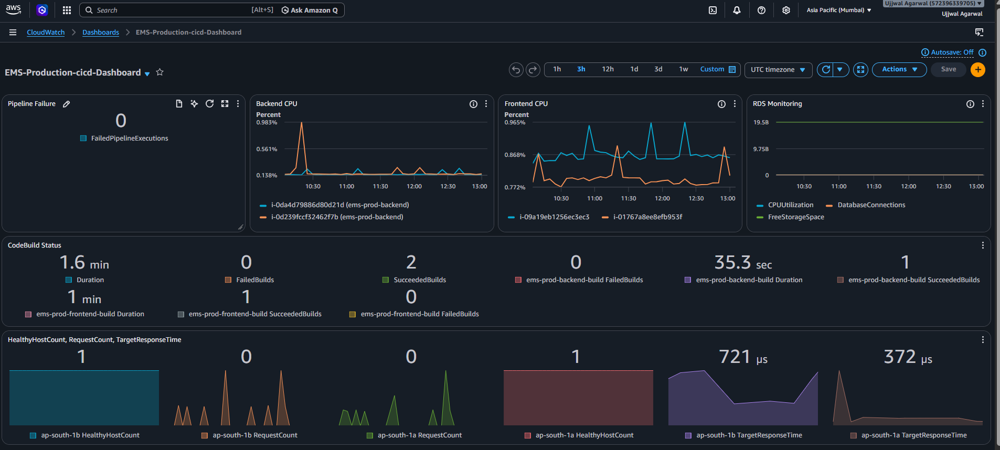
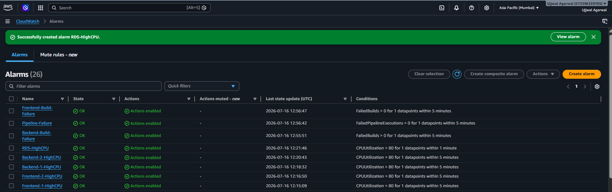
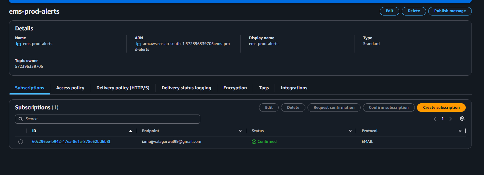
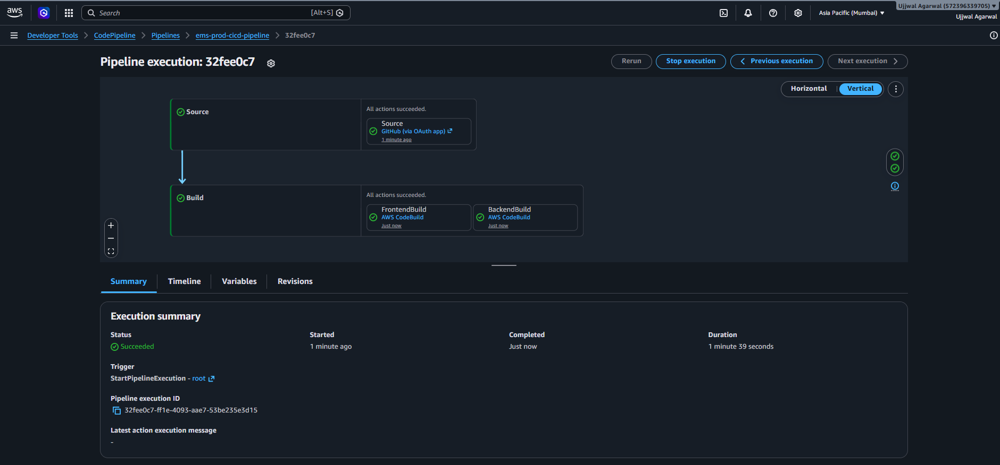
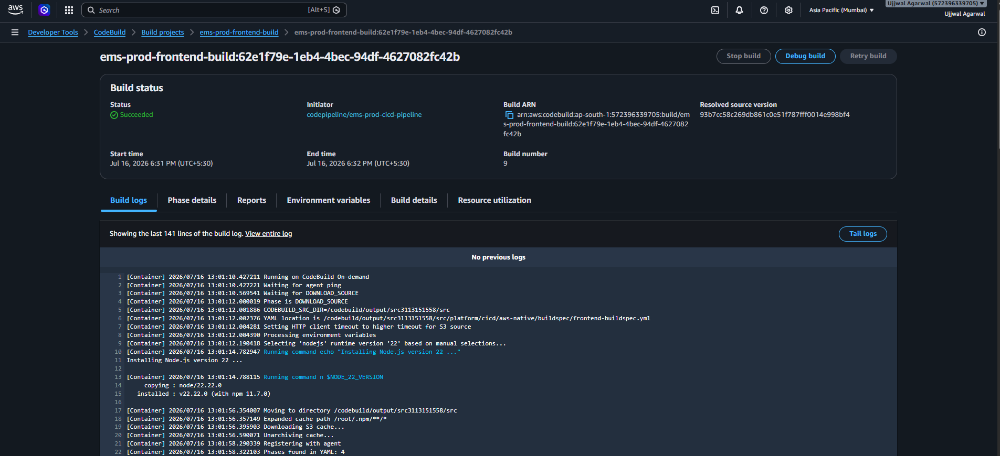
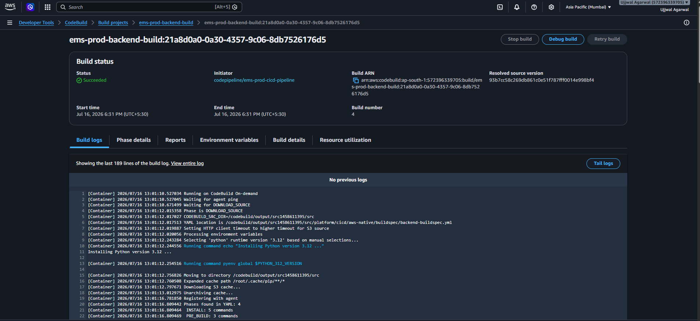

# 🚀 AWS Production-Inspired Employee Management System

<div align="center">


**Production-inspired Employee Management System demonstrating AWS High Availability, Auto Scaling, CloudWatch Monitoring, and AWS Native Continuous Integration using CodePipeline & CodeBuild.**

</div>

---

## 📌 Project Status

| Phase | Status |
|--------|--------|
| Phase 1 – AWS Infrastructure | ✅ Completed |
| Phase 2 – AWS Native Continuous Integration | ✅ Completed |
| Phase 3 – Jenkins CI/CD | 🚧 Planned |
| Phase 4 – Infrastructure as Code (Terraform & Ansible) | 📅 Planned |
| Phase 5 – Kubernetes & GitOps | 📅 Planned |

---

## 🎯 Project Objective

This project is designed to simulate a **real-world production deployment** of an Employee Management System on AWS while following DevOps best practices.

Instead of focusing only on application development, the project demonstrates how a production application is:

- Designed for **High Availability**
- Scaled automatically using **Auto Scaling Groups**
- Exposed securely through **Application Load Balancers**
- Connected to a managed **Amazon RDS** database
- Integrated with **AWS Systems Manager Parameter Store**
- Continuously built using **AWS CodePipeline** and **AWS CodeBuild**
- Monitored using **Amazon CloudWatch Dashboards**
- Protected with **CloudWatch Alarms** and **Amazon SNS Notifications**

The goal is to build the project incrementally across multiple phases, where each phase introduces new production-grade DevOps capabilities.

## 📚 Table of Contents

- [📌 Project Status](#-project-status)
- [🎯 Project Objective](#-project-objective)
- [🏗️ System Architecture](#️-system-architecture)
- [✨ Key Features](#-key-features)
- [🛠️ Technology Stack](#️-technology-stack)
- [☁️ AWS Services Used](#️-aws-services-used)
- [📂 Repository Structure](#-repository-structure)
- [🚀 Implementation Journey](#-implementation-journey)
- [📊 Monitoring & Alerting](#-monitoring--alerting)
- [📸 Project Screenshots](#-project-screenshots)
- [⚙️ Getting Started](#️-getting-started)
- [🗺️ Project Roadmap](#️-project-roadmap)
- [📚 Documentation](#-documentation)
- [🤝 Contributing](#-contributing)
- [📜 License](#-license)

---

# 🏗️ System Architecture

This project follows a **production-inspired AWS architecture** designed around High Availability, scalability, observability, and CI best practices.

The architecture is divided into two major layers:

## 🌐 Infrastructure Layer (Phase 1)

- Multi-tier AWS deployment
- Public and Private networking
- Application Load Balancers
- Auto Scaling Groups
- Amazon RDS
- AWS Systems Manager Parameter Store
- CloudWatch Agent

---

## 🔄 Continuous Integration Layer (Phase 2)

Every code push follows the automated workflow below:

Developer

↓

GitHub Repository

↓

AWS CodePipeline

↓

Frontend CodeBuild

+

Backend CodeBuild

↓

CloudWatch Logs

↓

CloudWatch Dashboard

↓

CloudWatch Alarms

↓

Amazon SNS Notifications

---

> 📌 **Architecture diagrams will be added after completing all project phases.**

---

# ✨ Key Features

The project is implemented in multiple phases, gradually evolving from a cloud-hosted application into a production-inspired DevOps platform.

## 🖥️ Application Features

- Employee management (Create, Read, Update, Delete)
- Department management
- Interactive dashboard with employee statistics
- Responsive React-based user interface
- RESTful API powered by FastAPI
- Modular frontend and backend architecture
- Real-time dashboard components
- Clean and reusable component structure

---

## ☁️ AWS Infrastructure Features (Phase 1)

- Production-inspired VPC architecture
- Public and Private Subnets across multiple Availability Zones
- Internet Gateway and NAT Gateway
- Public and Internal Application Load Balancers
- Frontend and Backend Auto Scaling Groups
- Launch Templates for immutable infrastructure
- Amazon RDS for managed database services
- AWS Systems Manager Parameter Store for secure configuration management
- Security Groups implementing least-privilege access
- CloudWatch Agent installed on EC2 instances
- Highly Available application architecture

---

## 🔄 Continuous Integration Features (Phase 2)

- GitHub as the source code repository
- AWS CodePipeline for automated CI workflow
- Independent Frontend and Backend CodeBuild projects
- Automatic build execution on every Git push
- Build logs stored in Amazon CloudWatch Logs
- Build artifact generation
- Parallel frontend and backend build execution
- Automated source integration and validation

---

## 📊 Monitoring & Alerting

- Amazon CloudWatch Dashboard
- CloudWatch Metrics collection
- CloudWatch Alarms
- Amazon SNS Email Notifications
- Pipeline failure monitoring
- Build failure monitoring
- EC2 CPU utilization monitoring
- Amazon RDS CPU monitoring
- Centralized operational visibility

---

## 🔒 Production Best Practices

- High Availability Architecture
- Scalable Infrastructure
- Infrastructure separated into logical layers
- Secure parameter management
- Operational monitoring
- Automated Continuous Integration
- Modular repository organization
- Documentation-driven project structure

---

# 🛠️ Technology Stack

The project combines modern frontend and backend technologies with AWS cloud services and DevOps tools to simulate a production-ready environment.

| Category | Technologies |
|----------|--------------|
| **Frontend** | React 19, Vite, JavaScript (ES6+), HTML5, CSS3 |
| **Backend** | FastAPI, Python 3.12, Uvicorn |
| **Database** | MySQL (Amazon RDS) |
| **Cloud Platform** | Amazon Web Services (AWS) |
| **Networking** | VPC, Public & Private Subnets, Internet Gateway, NAT Gateway |
| **Compute** | Amazon EC2, Auto Scaling Groups, Launch Templates |
| **Load Balancing** | Application Load Balancer (Public & Internal) |
| **CI/CD** | AWS CodePipeline, AWS CodeBuild |
| **Configuration Management** | AWS Systems Manager Parameter Store |
| **Monitoring** | Amazon CloudWatch, CloudWatch Dashboard, CloudWatch Alarms |
| **Notifications** | Amazon SNS |
| **Operating System** | Ubuntu Server 24.04 LTS |
| **Version Control** | Git, GitHub |
| **Development Tools** | VS Code, AWS CLI, Git CLI |

---

# ☁️ AWS Services Used

This project leverages multiple AWS services to build a scalable, highly available, and production-inspired cloud environment.

| Service | Purpose |
|----------|---------|
| **Amazon EC2** | Hosts the frontend and backend application servers |
| **Amazon VPC** | Provides secure network isolation |
| **Application Load Balancer (ALB)** | Distributes incoming traffic across multiple EC2 instances |
| **Auto Scaling Groups** | Automatically maintain and scale EC2 instances |
| **Launch Templates** | Standardize EC2 instance configuration |
| **Amazon RDS** | Managed relational database service |
| **AWS Systems Manager Parameter Store** | Secure storage of application configuration and secrets |
| **AWS CodePipeline** | Automates Continuous Integration workflow |
| **AWS CodeBuild** | Builds frontend and backend applications automatically |
| **Amazon CloudWatch** | Collects metrics, logs, and dashboards |
| **CloudWatch Alarms** | Detects failures and resource threshold breaches |
| **Amazon SNS** | Sends email notifications for critical events |
| **IAM** | Secure access management for AWS resources |

---

## 📊 Project Statistics

| Metric | Value |
|---------|------:|
| **Application Architecture** | Full Stack |
| **Frontend Framework** | React + Vite |
| **Backend Framework** | FastAPI |
| **Cloud Provider** | AWS |
| **Availability Zones** | Multi-AZ |
| **Application Load Balancers** | 2 |
| **Auto Scaling Groups** | 2 |
| **CodeBuild Projects** | 2 |
| **CodePipeline Pipelines** | 1 |
| **CloudWatch Dashboard** | 1 |
| **SNS Topics** | 1 |
| **CloudWatch Alarms** | 6+ |
| **Project Phases Completed** | 2 | 

---

# 📂 Repository Structure

The repository is organized into modular directories to separate application code, infrastructure configuration, monitoring assets, and documentation. This structure follows a clean and scalable layout inspired by real-world DevOps projects.

```text
employee-management-system/
│
├── app/                     # Frontend and Backend application source code
│   ├── backend/             # FastAPI backend application
│   └── frontend/            # React frontend application
│
├── assets/
│   ├── diagrams/            # Architecture diagrams
│   └── screenshots/         # Project screenshots
│       ├── phase-1/
│       └── phase-2/
│
├── docs/                    # Technical documentation
│
├── platform/
│   ├── bootstrap/           # EC2 bootstrap scripts
│   ├── cicd/                # AWS CodePipeline & CodeBuild configuration
│   └── observability/       # CloudWatch monitoring configuration
│
├── tests/                   # Future test suites
│
├── README.md
├── LICENSE
├── CONTRIBUTING.md
└── CHANGELOG.md
```

---

## 📁 Directory Overview

| Directory | Description |
|-----------|-------------|
| **app/backend** | FastAPI backend source code including API routes, database models, services, and business logic. |
| **app/frontend** | React application with reusable components, pages, API services, and frontend utilities. |
| **assets/diagrams** | AWS architecture diagrams, CI workflow diagrams, and project illustrations. |
| **assets/screenshots** | Screenshots collected during each implementation phase for documentation purposes. |
| **docs** | Detailed project documentation including architecture, setup guide, operations guide, and runbook. |
| **platform/bootstrap** | EC2 bootstrap scripts used during infrastructure provisioning and server initialization. |
| **platform/cicd** | AWS CodeBuild buildspec files and deployment automation scripts. |
| **platform/observability** | CloudWatch Agent configuration and monitoring scripts. |
| **tests** | Reserved for backend, frontend, and infrastructure testing. |

---

# 🚀 Implementation Journey

The project is being developed incrementally across multiple phases, with each phase introducing additional cloud-native and DevOps capabilities.

| Phase | Focus Area | Status |
|--------|------------|--------|
| **Phase 1** | AWS Infrastructure & High Availability | ✅ Completed |
| **Phase 2** | AWS Native Continuous Integration & Monitoring | ✅ Completed |
| **Phase 3** | Jenkins-based Continuous Deployment | 🚧 Planned |
| **Phase 4** | Infrastructure as Code (Terraform & Ansible) | 📅 Planned |
| **Phase 5** | Kubernetes, GitOps & Observability | 📅 Planned |

---

## ✅ Phase 1 Highlights

- Designed a production-inspired AWS network architecture.
- Configured public and private subnets across multiple Availability Zones.
- Implemented Internet Gateway and NAT Gateway.
- Deployed Public and Internal Application Load Balancers.
- Configured Frontend and Backend Auto Scaling Groups.
- Created Launch Templates for immutable infrastructure.
- Integrated Amazon RDS for persistent data storage.
- Managed application configuration using AWS Systems Manager Parameter Store.
- Installed CloudWatch Agent for instance-level monitoring.

---

## ✅ Phase 2 Highlights

- Integrated GitHub with AWS CodePipeline.
- Configured independent Frontend and Backend AWS CodeBuild projects.
- Automated build execution on every Git push.
- Centralized build logs using Amazon CloudWatch Logs.
- Built a CloudWatch Dashboard for operational visibility.
- Configured CloudWatch Alarms for infrastructure and pipeline monitoring.
- Integrated Amazon SNS for automated email notifications.
- Refactored the repository into a clean and production-inspired structure.

---

# 📊 Monitoring & Alerting

A key objective of this project is to demonstrate operational visibility and proactive monitoring in a production-inspired AWS environment.

The monitoring stack was implemented using **Amazon CloudWatch** and **Amazon SNS** to provide centralized dashboards, real-time metrics, automated alarms, and email notifications.

---

## 📈 CloudWatch Dashboard

A centralized CloudWatch Dashboard provides real-time visibility into the health and performance of the application infrastructure and CI pipeline.

### Dashboard Widgets

| Widget | Purpose |
|----------|---------|
| 🔄 CodePipeline Status | Monitor pipeline execution failures |
| 🏗️ Frontend CodeBuild | Track frontend build success and failures |
| 🏗️ Backend CodeBuild | Track backend build success and failures |
| 💻 Frontend EC2 CPU | Monitor frontend instance utilization |
| 💻 Backend EC2 CPU | Monitor backend instance utilization |
| ⚖️ Application Load Balancer | Observe request count, healthy hosts, and traffic |
| 🗄️ Amazon RDS | Monitor CPU utilization and database connections |

> **Dashboard Screenshot**

<p align="center">

</p>

---

# 🚨 CloudWatch Alarms

CloudWatch Alarms continuously monitor critical AWS resources and automatically trigger notifications whenever predefined thresholds are exceeded.

The following alarms have been configured:

| Alarm | Purpose |
|---------|---------|
| Pipeline Failure | Detect failed CodePipeline executions |
| Frontend Build Failure | Detect failed frontend builds |
| Backend Build Failure | Detect failed backend builds |
| Frontend EC2 High CPU | Alert when frontend CPU exceeds threshold |
| Backend EC2 High CPU | Alert when backend CPU exceeds threshold |
| Amazon RDS High CPU | Alert when database CPU exceeds threshold |

> **CloudWatch Alarms**

<p align="center">

</p>

---

# 📧 Amazon SNS Notifications

Amazon SNS is integrated with CloudWatch Alarms to send email notifications whenever critical events occur.

Typical alert scenarios include:

- ❌ CodePipeline execution failure
- ❌ Frontend build failure
- ❌ Backend build failure
- ⚠️ High CPU utilization on EC2 instances
- ⚠️ High CPU utilization on Amazon RDS

This enables proactive monitoring and faster incident response.

> **SNS Topic**

<p align="center">

</p>

---

# 📜 CloudWatch Logs

AWS CodeBuild automatically publishes build logs to Amazon CloudWatch Logs.

This provides:

- Centralized build logging
- Build troubleshooting
- Error diagnostics
- Historical build records

Both frontend and backend build projects generate independent log streams for easier debugging.

> **CloudWatch Logs**

<p align="center">

</p>

---

# 📊 Operational Benefits

The monitoring implementation provides several production-oriented capabilities:

- ✅ Centralized operational dashboard
- ✅ Continuous infrastructure monitoring
- ✅ Automated pipeline health monitoring
- ✅ Build failure detection
- ✅ Resource utilization tracking
- ✅ Email-based incident notifications
- ✅ Faster troubleshooting through CloudWatch Logs
- ✅ Improved operational visibility

---

# ⚙️ Getting Started

This section explains how to set up and run the Employee Management System locally. For the complete AWS deployment process, refer to the documentation in the [`docs/`](docs/) directory.

## 📋 Prerequisites

Ensure the following software is installed before running the project:

| Software | Version |
|----------|---------|
| Git | Latest |
| Python | 3.12+ |
| Node.js | 20+ |
| npm | 10+ |
| MySQL | 8.0+ (or Amazon RDS) |
| AWS CLI | v2 |
| Ubuntu | 24.04 LTS (Recommended) |

---

## 📥 Clone the Repository

```bash
git clone https://github.com/<your-github-username>/employee-management-system.git

cd employee-management-system
```

---

# 🐍 Backend Setup

Navigate to the backend directory.

```bash
cd app/backend
```

Create a virtual environment.

```bash
python3 -m venv venv
```

Activate the virtual environment.

```bash
source venv/bin/activate
```

Install dependencies.

```bash
pip install -r requirements.txt
```

Configure your environment variables or AWS Systems Manager Parameter Store values.

Start the FastAPI server.

```bash
uvicorn app.main:app --host 0.0.0.0 --port 8000
```

Backend API

```
http://localhost:8000
```

Swagger Documentation

```
http://localhost:8000/docs
```

---

# ⚛️ Frontend Setup

Navigate to the frontend directory.

```bash
cd app/frontend
```

Install dependencies.

```bash
npm install
```

Start the development server.

```bash
npm run dev
```

Frontend

```
http://localhost:5173
```

---

# ☁️ AWS Deployment

The AWS infrastructure and deployment environment include:

- Amazon VPC
- Public & Private Subnets
- Internet Gateway
- NAT Gateway
- Application Load Balancers
- Auto Scaling Groups
- Launch Templates
- Amazon RDS
- AWS Systems Manager Parameter Store
- Amazon CloudWatch
- Amazon SNS
- AWS CodePipeline
- AWS CodeBuild

Detailed deployment instructions are available in:

- 📄 `docs/setup-guide.md`
- 📄 `docs/architecture.md`
- 📄 `docs/operations-guide.md`
- 📄 `docs/runbook.md`

---

# 🔄 Continuous Integration Workflow

Every code push follows the workflow below.

```
Developer
      │
      ▼
Git Push
      │
      ▼
GitHub Repository
      │
      ▼
AWS CodePipeline
      │
 ┌────┴────┐
 ▼         ▼
Frontend  Backend
CodeBuild CodeBuild
      │
      ▼
CloudWatch Logs
      │
      ▼
CloudWatch Dashboard
      │
      ▼
CloudWatch Alarms
      │
      ▼
Amazon SNS
```

This workflow ensures that every code change is automatically validated, monitored, and reported.

---

# 🧪 Validation Checklist

After deployment, verify the following:

- ✅ Frontend application is accessible
- ✅ Backend API is responding
- ✅ Application Load Balancer is healthy
- ✅ Target Groups report healthy targets
- ✅ Amazon RDS is available
- ✅ CodePipeline completes successfully
- ✅ Frontend CodeBuild succeeds
- ✅ Backend CodeBuild succeeds
- ✅ CloudWatch Dashboard displays metrics
- ✅ SNS notifications are delivered when alarms are triggered

---

# 📸 Project Screenshots

The following screenshots showcase the infrastructure, Continuous Integration pipeline, monitoring, and the application interface built throughout the project.

## ☁️ AWS Infrastructure (Phase 1)

| Component | Screenshot |
|-----------|------------|
| Amazon VPC |  |
| Public & Private Subnets |  |
| Route Tables |  |
| Amazon RDS |  |
| Parameter Store |  |
| Launch Template |  |
| Auto Scaling Groups |  |
| Public Application Load Balancer |  |
| Internal Application Load Balancer |  |
| Frontend Target Group |  |
| Backend Target Group |  |

---

## 🔄 Continuous Integration (Phase 2)

| Component | Screenshot |
|-----------|------------|
| AWS CodePipeline |  |
| Frontend CodeBuild |  |
| Backend CodeBuild |  |

---

## 📊 Monitoring & Alerting

| Component | Screenshot |
|-----------|------------|
| CloudWatch Dashboard |  |
| CloudWatch Alarms |  |
| Amazon SNS |  |
| CloudWatch Logs |  |

---

## 💻 Application

| Page | Screenshot |
|------|------------|
| Dashboard |  |

---

# 📚 Documentation

Detailed project documentation is available in the `docs/` directory.

| Document | Description |
|----------|-------------|
| 📖 `architecture.md` | Detailed AWS architecture and infrastructure design. |
| ⚙️ `setup-guide.md` | Local development environment setup and AWS deployment instructions. |
| 🛠️ `operations-guide.md` | Operational procedures, monitoring workflow, and maintenance tasks. |
| 🚑 `runbook.md` | Troubleshooting guide, recovery procedures, and common operational issues. |

These documents provide deeper technical details beyond the overview presented in this README.


  
